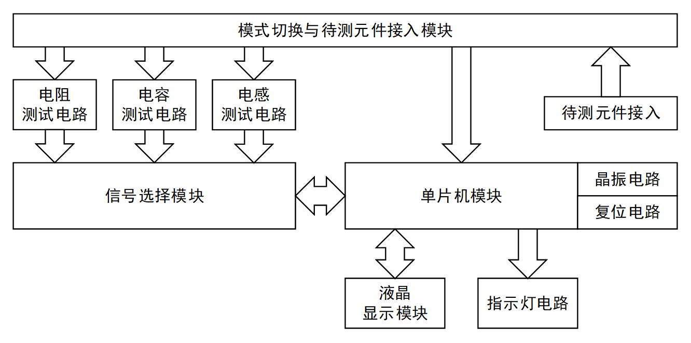
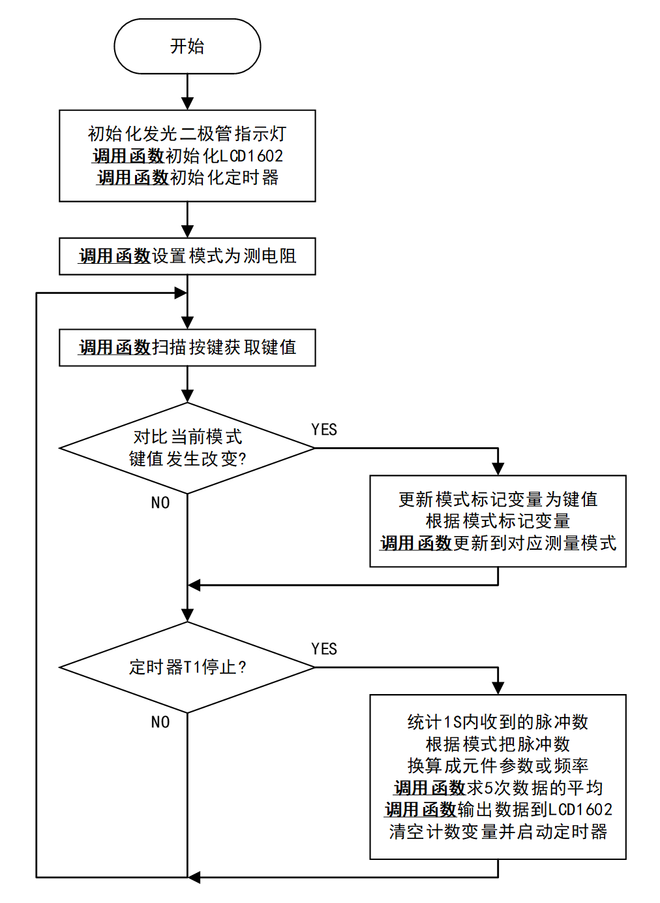
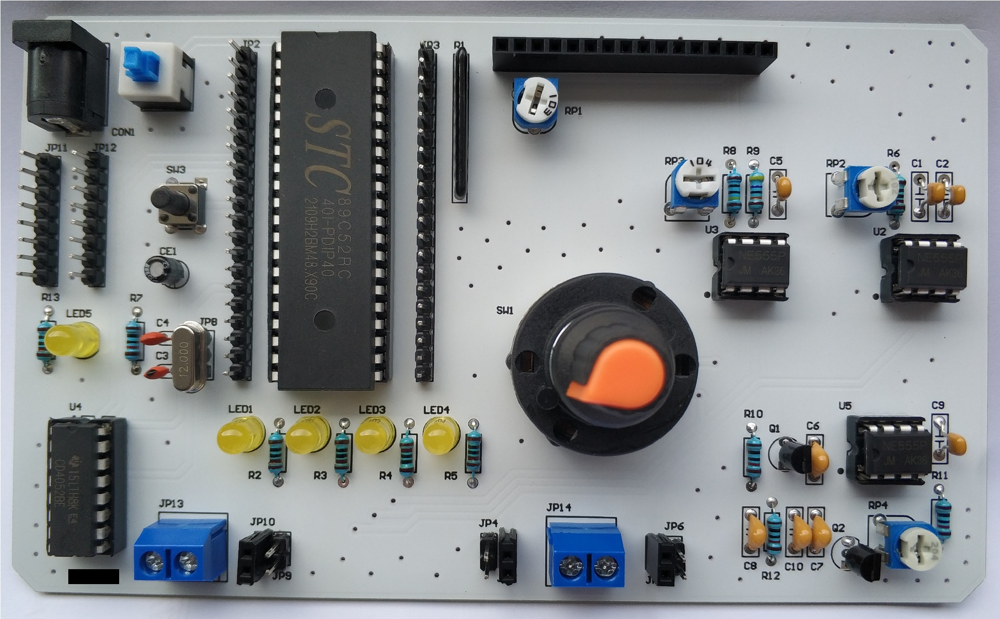

# RCL_Testing_System

The Resistance Capacitance Inductance Testing System

一款拾人牙慧的RCL测试系统

测量范围：
- 电阻 100Ω～1MΩ
- 电容 100pF～10000pF
- 电感 100μH～10mH；

测量误差：±5%

MCU：STC89C52RC

软件开发工具：Keil uVision5 C51 Version 9.60a (V5.27.1.0)

硬件开发工具：Altium Designer Version 21.2.2 (Build 38)

# 设计框图

# 软件流程

# 最终成品

